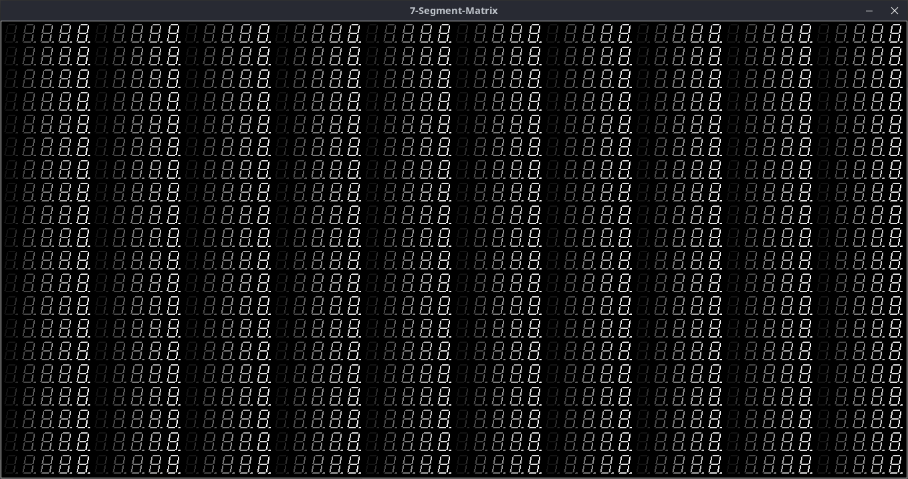
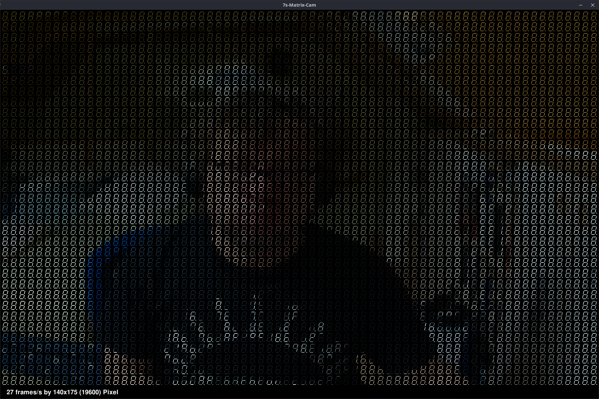

# 7s_matrix

Ich wollte schon immer mal wissen, wie man solche Bilder auf einer [Matrix aus 7-Segment-Anzeigen](https://willga.llia.io/sea-of-segments/) generiert! 

Angefangen dann hat alles mit ein paar Implementierungen von einfachen [Software-Simulatoren](#software-matrix) in Tcl und Python, um einige Algorithmen und Funktionsprinzipien auszuprobieren.

Spätestens nachdem ein paar coole Lösungen in den Simulatoren gefunden wurden, stellte sich die Frage: "Ok, und in Hardware...?". Es wird also Zeit, in die Bastelkisten nachzuschauen bzw. zu recherchieren, was da so in Frage kommen könnte. [Hier](#experimente) sind dazu ein paar Hardwareexperimente zu finden.

Da ich meine Projekte gern in der Öffentlichkeit vorstelle, sind hier auch noch ein paar [Slides](#slides-zum-projekt) zum aktuellen Projektstand in diesem Repository zu finden. Dort wird auch erklärt, wie Bilder für eine solche 7-Segment-Anzeige-Matrix ausgegeben werden können....

 

## Software-Matrix

### Tcl-Versionen

Der hier vorgestellte Simulator (**[7s_matrix.tcl](Simulator/Tcl/7s_matrix.tcl)**) ist ein, in TCL geschriebener, TCP/IP-Server, welcher eine solche 7-Segment-Anzeigen-Matrix aufbaut/anzeigt und auf rudimentäre Zeichen-Kommandos (get_xy, clear, set_pixel, set_bitmap_xpm) reagiert. Was diese Kommandos (mit ihren entsprechenden Parametern) bewirken, ist dem Quelltext von [**7s_matrix.tcl**](Simulator/Tcl/7s_matrix.tcl) zu entnehmen!

Zum Testen des Tcl-Matrix-Servers wurden einige Tcl-Clients ([7s_client1.tcl](Simulator/Tcl/7s_client1.tcl), [7s_client3.tcl](Simulator/Tcl/7s_client3.tcl), [7s_client4.tcl](Simulator/Tcl/7s_client4.tcl) --> mögliche Aufrufparameter etc. siehe Quelltext) implementiert:

### Python-Versionen

Die Python-Version des Simulators (**[7s_matrix.py](Simulator/Python/7s_matrix.py)**) stellt prinzipiell die gleichen Zeichenfunktionen wie die Tcl-Version zur Verfügung. Unterschied ist, dass die Kommunikation zwischen Client (Bsp. **[7s_client1.py](Simulator/Python/7s_client1.py)**) und Server (**[7s_matrix.py](Simulator/Python/7s_matrix.py)**) über eine [Named Pipe](https://en.wikipedia.org/wiki/Named_pipe) stattfindet.

Die Python-Versionen des Simulators sind eigentlich nur aus mangelnder Performance der Tcl-Version entstanden. Als Performancebremse konnte eindeutig [tkinter](https://de.wikipedia.org/wiki/Tkinter) (das Python-Pardon zur entsprechenden [Tcl/Tk-Version](https://de.wikipedia.org/wiki/Tk_(Toolkit))) identifiziert werden!

"Höhepunkt" des darauf folgenden Tunnings ist die [pygame](https://www.pygame.org/docs/)/[opencv](https://en.wikipedia.org/wiki/OpenCV)-Version des Simulators (**[7s_matrix_cam_pygame.py](Simulator/Python/7s_matrix_cam_pygame.py)**), welche die Frames einer, am PC, angeschlossenen Web-Cam online und in ausreichender/angenehmener Geschwindigkeit darstellen kann:

## Hardware-Matrix
### Experimente

Die jeweilige "Grundausrüstung" besteht aus einem [Raspberry PI Zero W 2](https://www.raspberrypi.com/products/raspberry-pi-zero-2-w/) und einer einfachen, über den "CSI-2 camera connector", angeschlossenen Kamera.

#### MAX7219

[Datenblatt MAX7219](https://www.analog.com/media/en/technical-documentation/data-sheets/max7219-max7221.pdf)

Meine [Programmquelltexte](https://github.com/boerge42/7s_matrix/tree/main/Hardware/Experimente/MAX7219/) dazu...

#### IS31FL3731

[Datenblatt IS31FL3731](https://www.lumissil.com/assets/pdf/core/IS31FL3731_DS.pdf)

Nicht wundern, dass es nicht nach einer 7-Segment-Matrix aussieht! Es ging hier hauptsächlich darum, eine natives Python-Modul zur Ansteuerung eines IS31FL3731 durch einen Raspberry zu schreiben! Die aufgesteckte LED-Matrix könnte man natürlich durch, geeignet verschaltete, 7-Segment-Anzeigen ersetzen.

Meine [Programmquelltexte](https://github.com/boerge42/7s_matrix/tree/main/Hardware/Experimente/IS31FL3731/) dazu...

## Slides zum Projekt
...[hier](Slides/ascii_art.pdf)...

----------------------
Uwe Berger; 2013, 2023, 2024