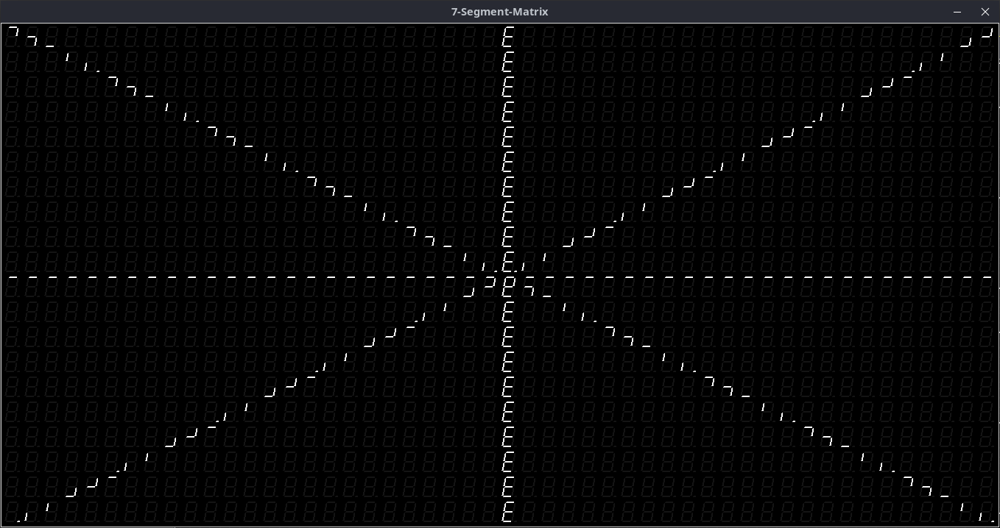
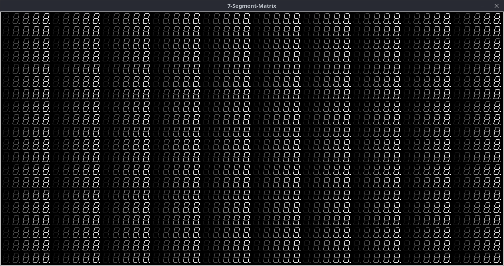
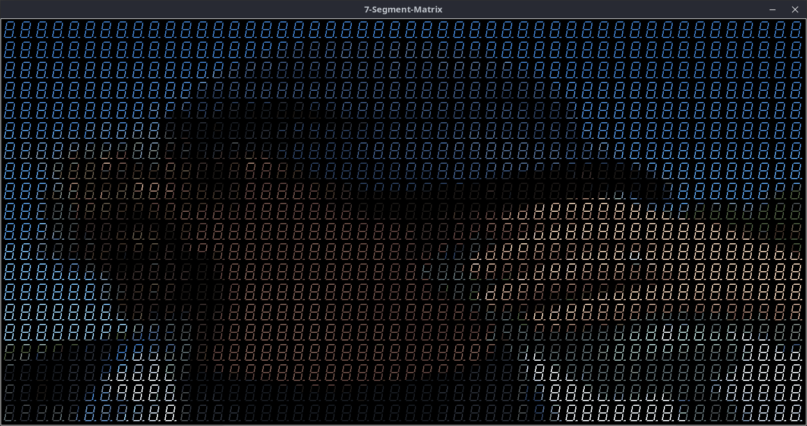

# 7s_matrix

Ich wollte schon immer mal wissen, wie man solche Bilder auf einer [Matrix aus 7-Segement-Anzeigen](https://willga.llia.io/sea-of-segments/) generiert! Beim Herumexperimentieren sind einige Software-Simulatoren in Tcl und Python entstanden...

##Tcl-Versionen (Unterverzeichnis: Tcl/)

Der hier vorgestellte Simulator (**[7s_matrix.tcl](Tcl/7s_matrix.tcl)**) ist ein, in TCL geschriebener, TCP/IP-Server, welcher eine solche 7-Segment-Anzeigen-Matrix aufbaut/anzeigt und auf rudimentäre Zeichen-Kommandos (get_xy, clear, set_pixel, set_bitmap_xpm) reagiert. Was diese Kommandos (mit ihren entsprechenden Parametern) bewirken, ist dem Quelltext von [**7s_matrix.tcl**](Tcl/7s_matrix.tcl) zu entnehmen!

Zum Testen des Tcl-Matrix-Servers wurden einige Tcl-Clients ([7s_client1.tcl](Tcl/7s_client1.tcl), [7s_client3.tcl](Tcl/7s_client3.tcl), [7s_client4.tcl](Tcl/7s_client4.tcl) --> mögliche Aufrufparameter etc. siehe Quelltext) implementiert:

##Python-Versionen (Unterverzeichnis: Python/)

Die Python-Version des Simulators (**[7s_matrix.py](Pathon/7s_matrix.py)**) stellt prinzipiell die gleichen Zeichenfunktionen wie die Tcl-Version zur Verfügung. Unterschied ist, dass die Kommunikation zwischen Client (Bsp. **[7s_client1.py](Python/7s_client1.py)**) und Server (**[7s_matrix.py](Python/7s_matrix.py)**) über eine [Named Pipe](https://en.wikipedia.org/wiki/Named_pipe) stattfindet.

Die Python-Versionen des Simulators sind eigentlich aus mangelnder Performance der Tcl-Version entstanden. Als Performancebremse konnte eindeutig [tkinter](https://de.wikipedia.org/wiki/Tkinter) (eigentlich ja das Python-Pardon zur entsprechenden [Tcl/Tk-Version](https://de.wikipedia.org/wiki/Tk_(Toolkit))) identifiziert werden!
"Höhepunkt" des darauf folgenden Tunnings ist die [pygame](https://www.pygame.org/docs/)/[opencv](https://en.wikipedia.org/wiki/OpenCV)-Version des Simulators (**[7s_matrix_cam_pygame.py](Python/7s_matrix_cam_pygame.py)**), welche die aufgenommenen Frames einer, am PC, angeschlossenen Web-Cam online und in ausreichender/angenehmen Geschwindigkeit darstellen kann:

----------------------
Uwe Berger; 2013, 2023