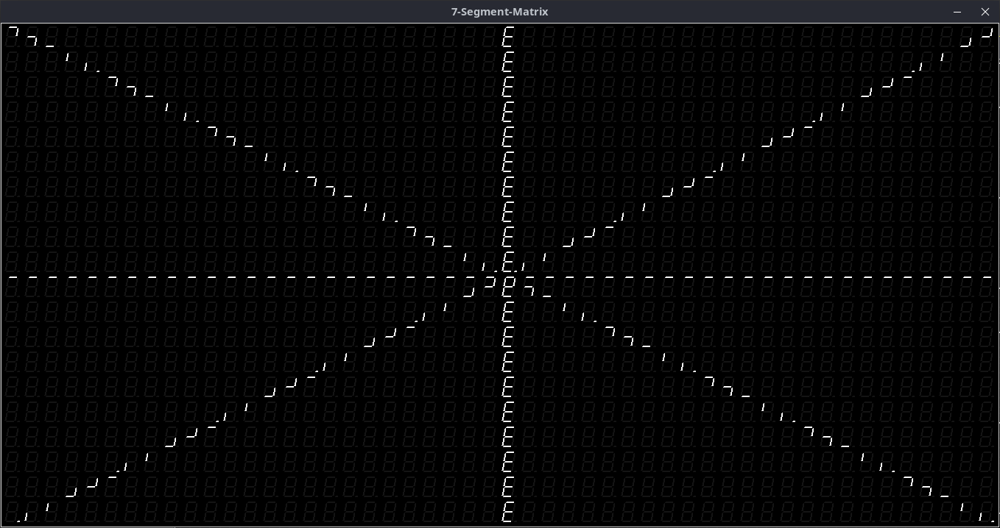
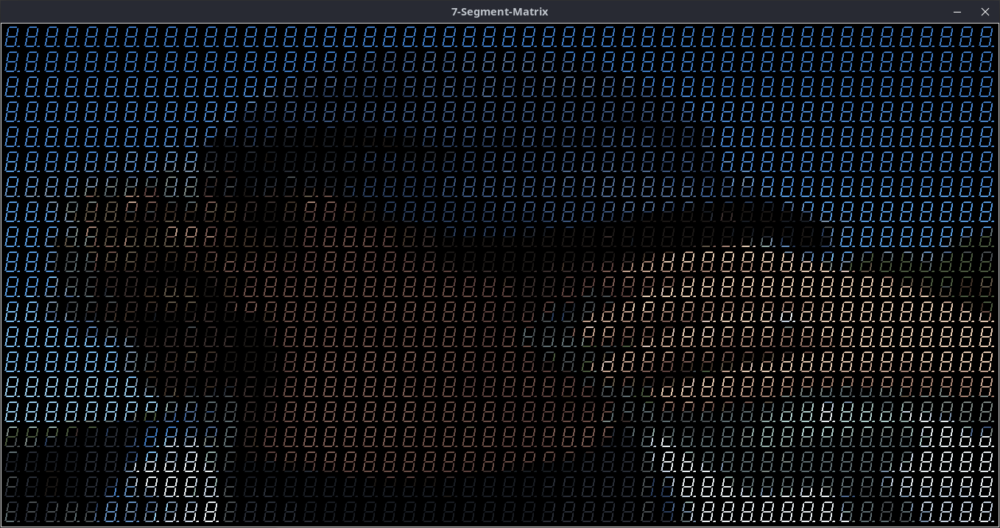
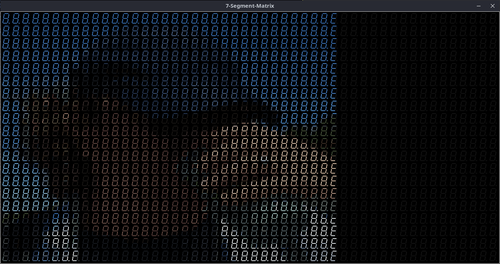

# 7s_matrix

Ich wollte schon immer mal wissen, wie man solche Bilder auf einer Matrix aus 7-Segement-Anzeigen generiert:

* https://willga.llia.io/sea-of-segments/

Der hier vorgestellte Simulator (**7s_matrix.tcl**) ist ein, in TCL geschriebener, TCP/IP-Server, welcher eine solche 7-Segment-Anzeigen-Matrix aufbaut/anzeigt und auf folgende Zeichen-Kommandos reagiert:

* get_xy
* clear
* set_pixel
* set_bitmap_xpm

Was diese Kommandos (mit ihren entsprechenden Parametern) bewirken, ist dem Quelltext von **7s_matrix.tcl** zu entnehmen!

Zum Testen des Matrix-Servers wurden einige Clients (mögliche Aufrufparameter siehe Quelltext) implementiert:

Ausgabe **7s_client1.tcl** (Test: get_xy, clear, set_pixel):

Ausgabe **7s_client3.tcl** (Test: get_xy, clear, set_bitmap_xmp):

Ausgabe **7s_client4.tcl** (Test: get_xy, clear, set_bitmap_xpm (Matrix: 100x100; 32 Farben)):

Ausgabe **7s_client4.tcl** (Test: get_xy, clear, set_bitmap_xpm (Matrix: 150x100; 32 Farben)):

----------------------
Uwe Berger; 2013, 2023